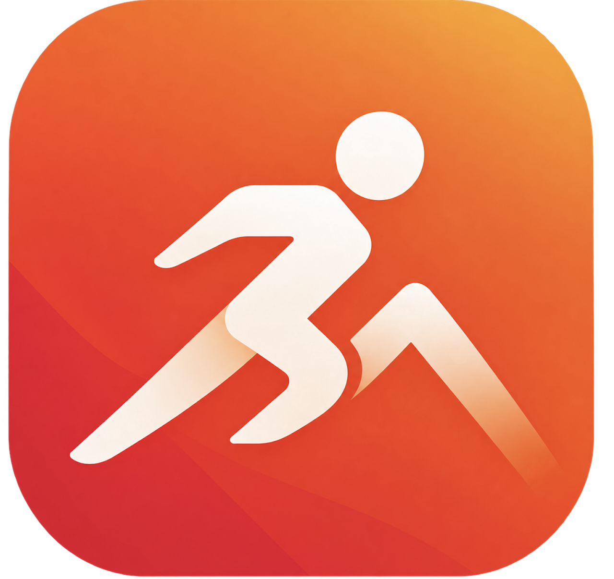
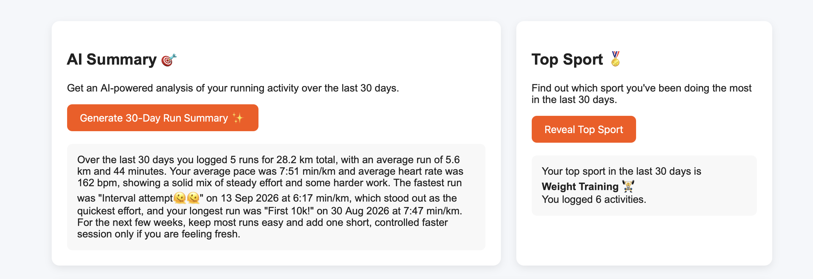
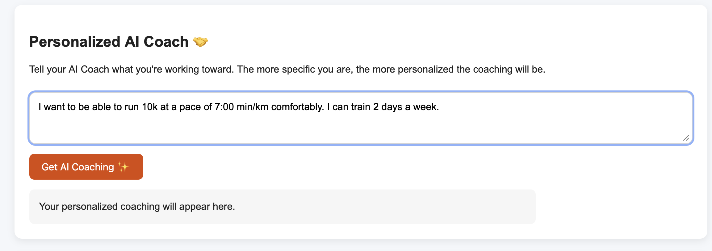
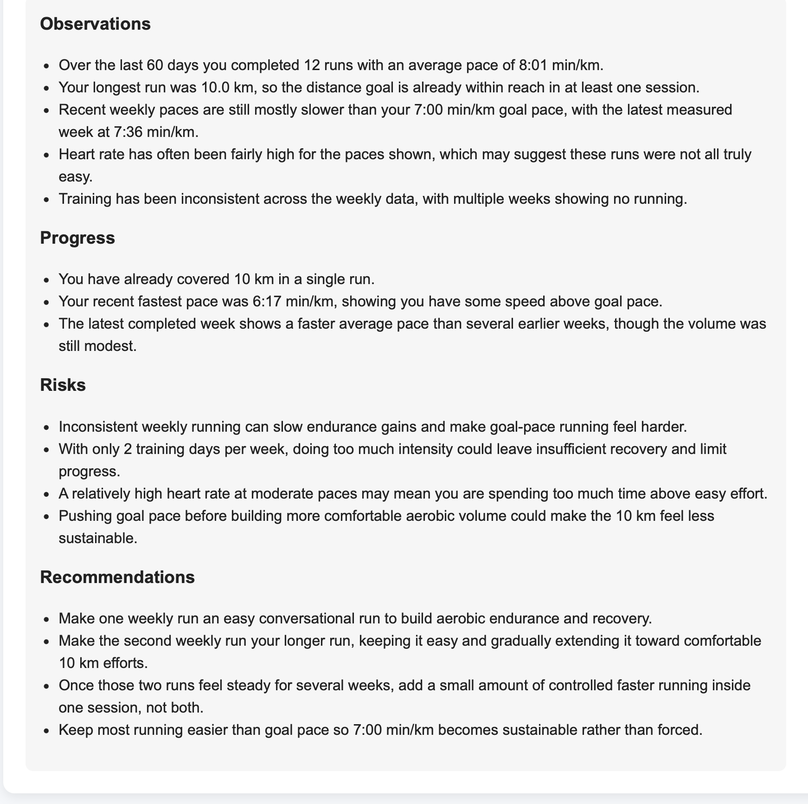
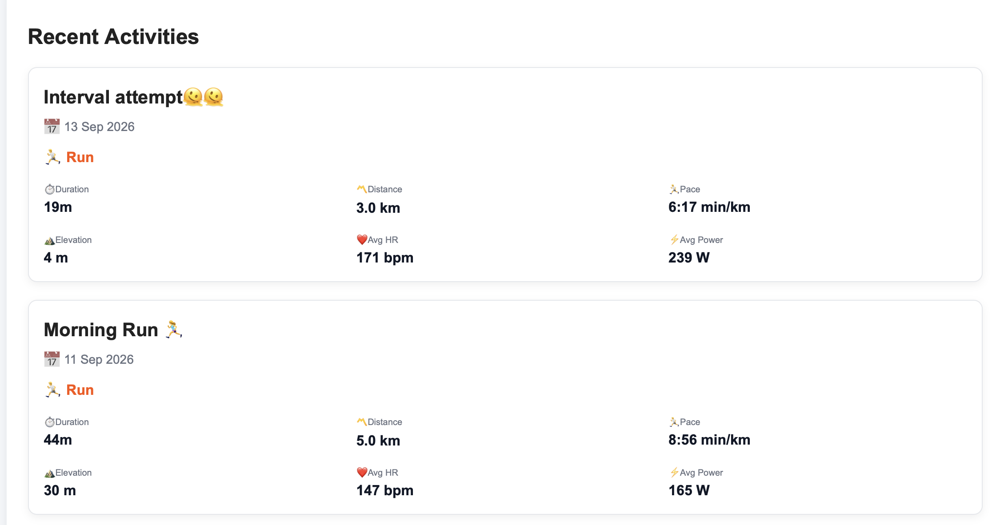

<h1>
  
  StriveAI
</h1>

> An AI-powered platform which turns your Strava training history into personalized performance insights and actionable training recommendations.

**🚀 Link:** https://go-service-production-eace.up.railway.app

StriveAI connects to Strava, analyzes recent training, and uses AI to provide personalized insights and training recommendations.

> **Current status:** First production deployment. Core functionality is live and working end-to-end; I'm continuing to improve the training recommendation logic, user experience, and reliability.

## What it does

### 📊 Training Summary
Provides a monthly overview of training patterns, including volume, pace, heart rate, consistency, and other key metrics. **Currently based on running activities.**


### 🏅 Top Sport
Identifies your most frequently practiced sport across **all recorded activities**, giving you a quick view of where most of your training is going.



### 🤖 Personalized Training Recommendations
Analyzes your recent **running training** and goals to generate personalized recommendations around training structure, pacing, recovery, and progression





### 📋 Recent Activities
Shows your recent activities across **all supported sports**, including activity type, distance, duration, pace, heart rate, and other available metrics.




## How it works

StriveAI connects to Strava through OAuth, stores activity data in PostgreSQL, calculates training metrics in a Go backend, and uses a Python-based training recommendation service to generate AI insights.


## Architecture

```text
Frontend
   │
   ▼
Go Backend ───────► PostgreSQL
   │
   │ gRPC
   ▼
Python Service
   │
   ▼
OpenAI
```

The application is currently in its first production deployment. The core functionality is working end-to-end, and I am continuing to improve the training recommendation logic, user experience, and overall reliability.
Current AI analysis and training recommendations are focused on running activities, while activity history and sport-level statistics include all recorded activities
